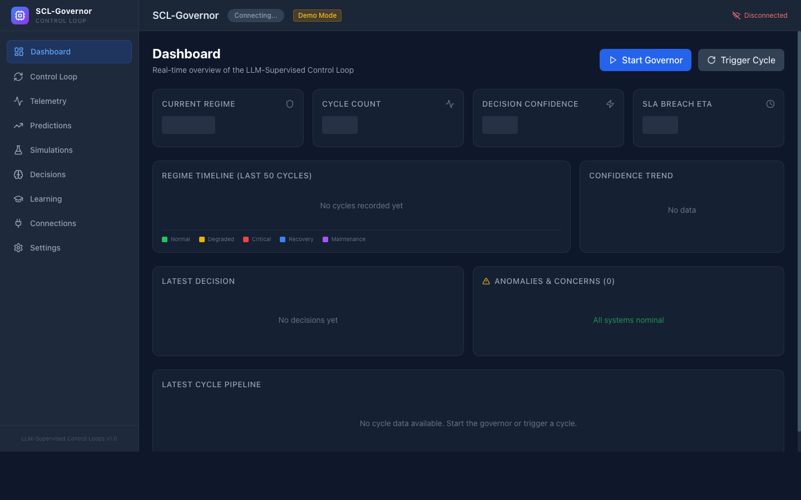
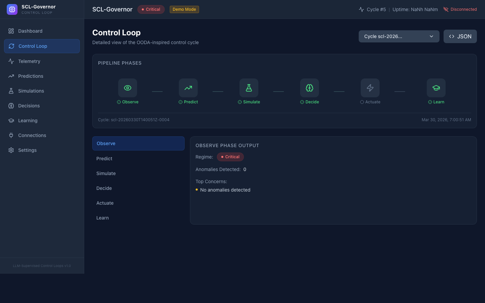
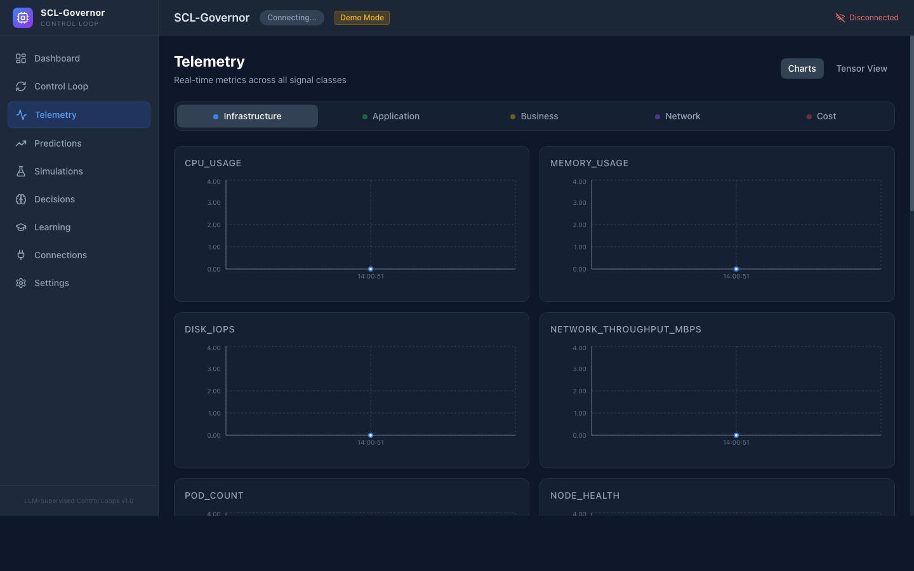
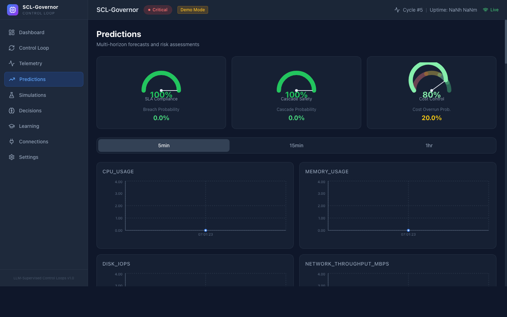
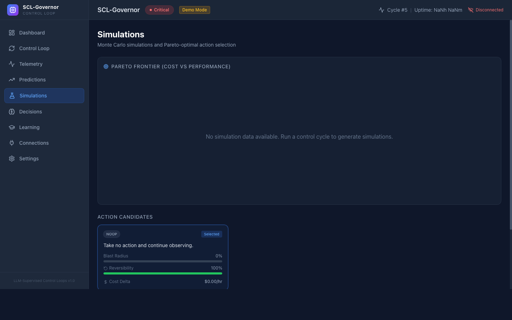
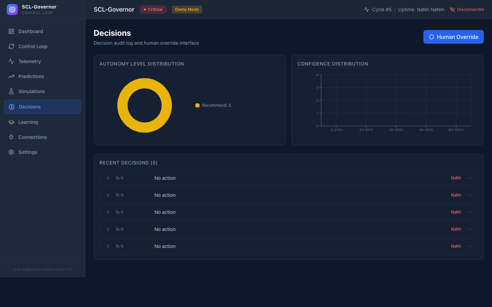
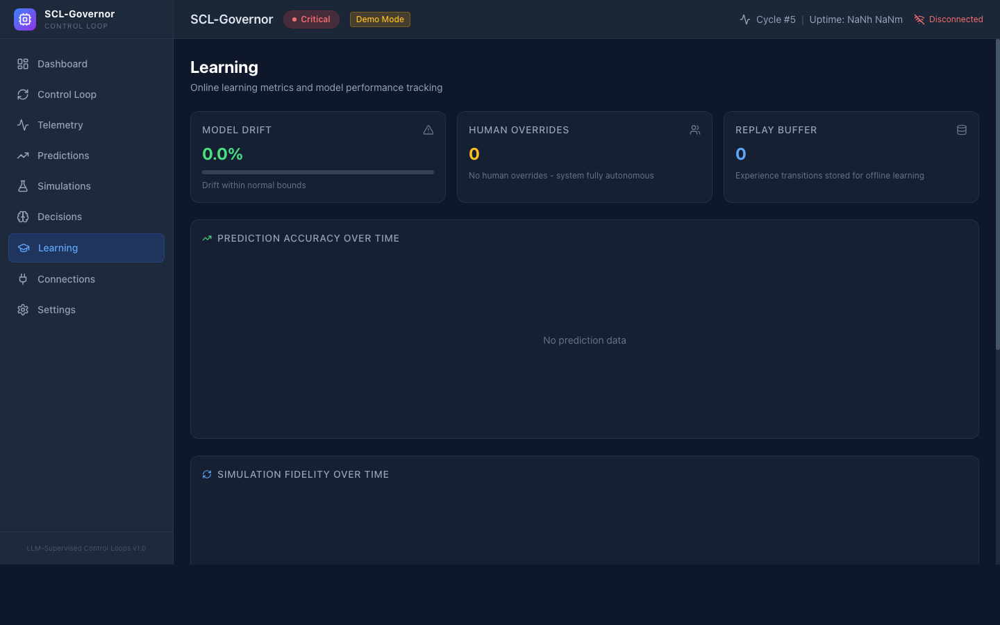
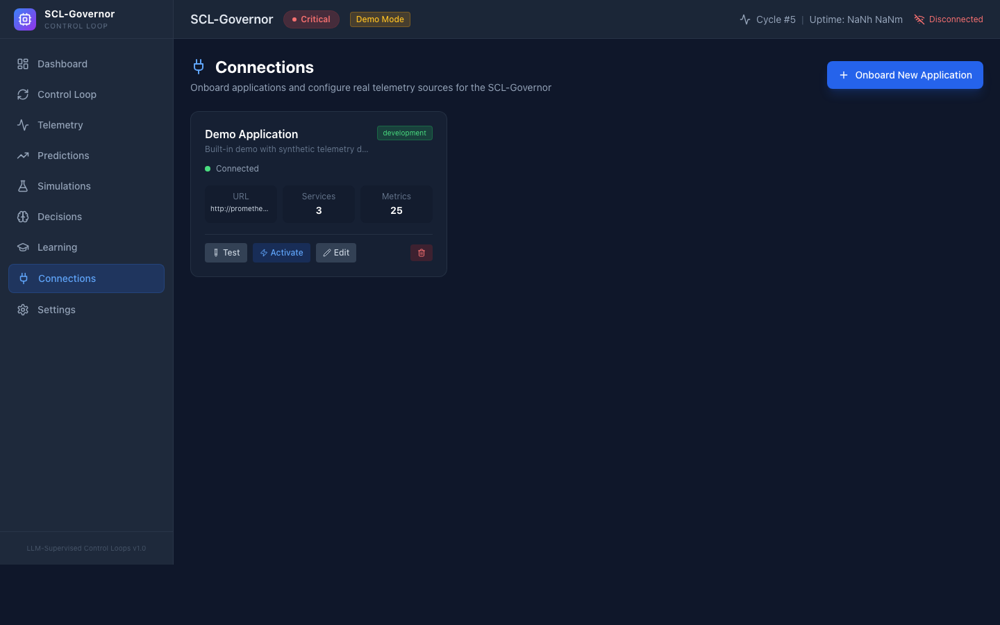
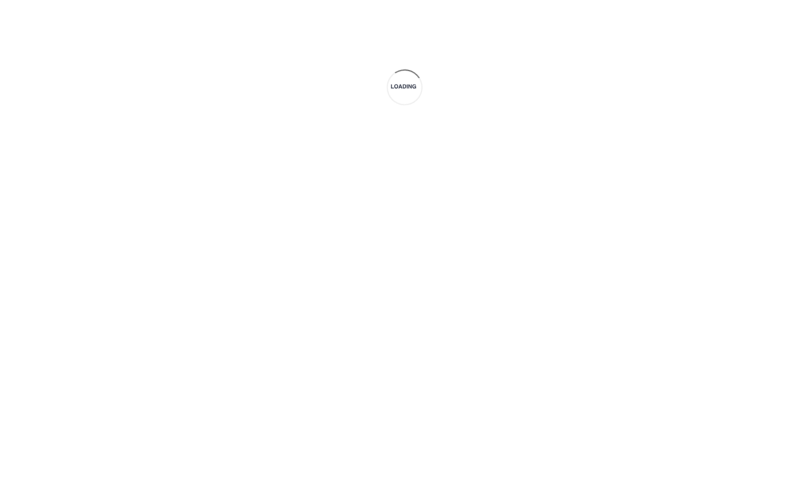

# LLM-Supervised Control Loops (SCL) -- Autonomous Infrastructure Governor


SCL-Governor replaces static, threshold-based SLO alerting and manual runbook execution with **LLM-supervised closed-loop feedback control** for cloud-native infrastructure. It continuously observes system telemetry, predicts future state trajectories using ensemble forecasting, simulates candidate remediation actions through Monte Carlo methods, and leverages large language models to select optimal interventions -- all governed by hard safety constraints, confidence-gated autonomy levels, and staged rollout with automatic rollback.

---

## Dashboard Preview



*The main dashboard showing real-time system regime, control cycle status, confidence gauge, anomaly detection, and the 6-phase control loop pipeline.*

---

## Architecture

The SCL-Governor operates as a six-phase continuous control loop:

```
    +-------------------------------------------------------------+
    |                   SCL-Governor Control Loop                  |
    |                                                              |
    |   (1) OBSERVE          (2) PREDICT          (3) SIMULATE    |
    |   +------------+       +------------+       +------------+  |
    |   | Telemetry  | ----> | Ensemble   | ----> | Monte Carlo|  |
    |   | Ingestion  |       | Forecasting|       | SDE Engine |  |
    |   | Prometheus |       | Statistical|       | N Scenarios|  |
    |   | OTel       |       | + Trend    |       | VaR / CVaR |  |
    |   | Custom     |       | + LLM      |       |            |  |
    |   +------------+       +------------+       +------------+  |
    |         |                                         |          |
    |         v                                         v          |
    |   +------------+       +------------+       +------------+  |
    |   | State      |       | Confidence |       | Candidate  |  |
    |   | Vector     |       | Gate       |       | Actions    |  |
    |   +-----+------+       +-----+------+       +-----+------+  |
    |         |                     |                     |        |
    |         +----------+----------+----------+----------+        |
    |                    |                     |                   |
    |              (4) DECIDE            (5) ACTUATE               |
    |              +------------+        +------------+            |
    |              | LLM-Powered|        | Staged     |            |
    |              | Multi-Obj  | -----> | Rollout    |            |
    |              | Optimizer  |        | Canary     |            |
    |              | Safety     |        | Auto-      |            |
    |              | Constraints|        | Rollback   |            |
    |              +------------+        +-----+------+            |
    |                                         |                   |
    |                                         v                   |
    |                                   (6) LEARN                  |
    |                                   +------------+             |
    |                                   | Outcome    |             |
    |                                   | Tracking   |             |
    |                                   | Weight     |             |
    |                                   | Updates    |             |
    |                                   | Drift      |             |
    |                                   | Detection  |             |
    |                                   +-----+------+             |
    |                                         |                   |
    |                                         +----> Loop Back    |
    +-------------------------------------------------------------+
```

---

## Application Pages

### 1. Dashboard


The central command view for the SCL-Governor. At a glance you can see:
- **Current Regime** (Normal/Degraded/Critical/Recovery/Maintenance)
- **Cycle Count** and real-time control loop status
- **Decision Confidence** gauge showing how confident the governor is in its latest action
- **SLA Breach ETA** countdown
- **Regime Timeline** tracking regime transitions over the last 50 cycles
- **Latest Decision** summary with action, reasoning, and autonomy level
- **Anomalies & Concerns** detected across all telemetry dimensions
- **Cycle Pipeline** showing the 6-phase execution status

Use the **Start Governor** button to begin continuous autonomous control, or **Trigger Cycle** to run a single manual cycle.

---

### 2. Control Loop


Deep-dive into individual control cycles. Select any cycle from the dropdown to inspect:
- **Phase Timeline** showing Observe -> Predict -> Simulate -> Decide -> Actuate -> Learn with timing for each phase
- **Phase Detail Panels** with the raw output from each phase
- **JSON View** toggle for the complete cycle output (useful for debugging and audit)

---

### 3. Telemetry


Real-time telemetry explorer across five signal dimensions:
- **Infrastructure**: CPU, memory, disk IOPS, network throughput, pod count, node health
- **Application**: Request rate, latency percentiles (p50/p95/p99), error rates, queue depth, connection pool utilization
- **Business**: Active users, transaction throughput, SLA compliance
- **Network**: Inter-service latency, DNS resolution, TCP retransmits, circuit breaker states
- **Cost**: Cloud spend rate, reserved capacity utilization, spot instance count

Each metric shows a live chart with anomaly indicators (red badges when MAD z-score exceeds threshold). The **State Tensor Heatmap** provides an at-a-glance view of all metrics color-coded by anomaly severity. **Trend Vectors** show the rate of change over 5min, 15min, and 1hr windows.

---

### 4. Predictions


Multi-horizon probabilistic forecasting dashboard:
- **Risk Assessment Gauges** for SLA breach probability, cascading failure probability, and cost overrun probability
- **Horizon Tabs** (5min, 15min, 1hr) with per-metric forecasts showing q10/q50/q90 confidence bands
- **Causal Insights** from the LLM reasoning layer identifying root causes (e.g., "DB connection pool saturation driving latency, not traffic volume")
- **Model Confidence** breakdown showing ensemble weights

---

### 5. Simulations


Monte Carlo simulation results for candidate actions:
- **Pareto Frontier** scatter plot (cost vs. performance, colored by SLA compliance probability)
- **Action Cards** for top candidates showing expected objective, VaR, CVaR, cost delta, and reversibility
- **Comparison Table** across all simulated actions
- **Scenario Distribution** histogram for the selected action

---

### 6. Decisions


Decision audit log and analytics:
- **Decision Table** with timestamp, selected action, confidence, autonomy level, and execution status
- **Expandable Rows** revealing full reasoning chain, rollback plan, and simulation summary
- **Autonomy Distribution** pie chart showing the breakdown of execute/notify/recommend/escalate decisions
- **Confidence Histogram** tracking decision quality over time
- **Human Override** form for submitting operator feedback that feeds into the learning loop

---

### 7. Learning


Continuous learning and model improvement dashboard:
- **Prediction Accuracy** trend chart tracking forecast quality over time
- **Simulation Fidelity** showing how well simulated outcomes match reality
- **Reward Signal History** from the RLHF-style feedback loop
- **Model Drift Indicator** alerting when prediction errors systematically increase
- **Experience Replay Buffer** size (state/action/reward tuples stored for policy updates)
- **Human Override Patterns** tracking when operators override the governor's decisions

---

### 8. Connections (Application Onboarding)


Onboard any application into the SCL-Governor by providing connection details:
- **Connection Cards** showing each configured application with status, Prometheus URL, service count, and metrics count
- **Demo Connection** pre-configured with synthetic telemetry for immediate exploration
- **7-Step Onboarding Wizard**:
  1. Basic Info (name, description, environment)
  2. Prometheus Connection (URL, auth, test button)
  3. Services & SLOs (dynamic list with custom latency/error/availability targets)
  4. Kubernetes (optional cluster configuration)
  5. Notifications (Slack, PagerDuty)
  6. LLM Configuration (Anthropic Claude or OpenAI API key)
  7. Review & Connect (test all connections, save & activate)
- **Test Connection** button verifies Prometheus, K8s, services, and LLM reachability
- **Activate** hot-swaps the governor to pull telemetry from the selected connection

---

### 9. Settings


Configuration management:
- **Cycle Interval** slider (1-60 seconds)
- **Objective Weights** sliders for performance, cost, risk, stability, and business impact
- **Confidence Thresholds** for autonomy gating (high, medium, low)
- **Safety Constraints** display (min replicas, budget ceiling, max blast radius, cooldown)
- **Connector Status** showing which infrastructure integrations are active

---

### 10. API Documentation


Interactive Swagger/OpenAPI documentation auto-generated by FastAPI at `/docs`. Test any endpoint directly from the browser.

---

## Feature Highlights

- **Real-time telemetry ingestion** -- Pulls metrics from Prometheus and OpenTelemetry across infrastructure, application, business, network, and cost dimensions
- **Predictive state modeling** -- Ensemble forecasting combining statistical methods, trend analysis, and LLM-based prediction at 5-minute, 15-minute, and 1-hour horizons
- **Monte Carlo simulation** -- SDE-based stochastic simulation engine running N configurable scenarios per cycle to compute VaR and CVaR risk metrics
- **LLM-powered decision making** -- Anthropic Claude or OpenAI models evaluate candidate actions against multi-objective criteria
- **Confidence-gated autonomy** -- Four autonomy levels from fully autonomous to mandatory human approval
- **Staged rollout with automatic rollback** -- Canary deployments with progressive traffic shifting
- **Continuous learning** -- Post-action outcome tracking feeds back into ensemble weight updates and drift detection
- **Application onboarding** -- Connect any application via Prometheus URL with a guided wizard
- **Safety constraints and regime detection** -- Hard constraints combined with automatic regime classification

---

## Tech Stack

### Backend

| Component           | Technology                          |
|---------------------|-------------------------------------|
| Language            | Python 3.11+                        |
| Web Framework       | FastAPI                             |
| Data Validation     | Pydantic v2                         |
| Numerical Computing | NumPy, SciPy                        |
| LLM Integration     | Anthropic SDK, OpenAI SDK           |
| Metrics             | prometheus-client                   |
| Caching / State     | Redis (via aioredis)                |
| Logging             | structlog (JSON)                    |

### Frontend

| Component           | Technology                          |
|---------------------|-------------------------------------|
| Language            | TypeScript                          |
| Framework           | React 18                            |
| Build Tool          | Vite 6                              |
| Styling             | Tailwind CSS                        |
| Charts              | Recharts                            |
| State Management    | Zustand                             |
| Icons               | lucide-react                        |

### Infrastructure

| Component           | Technology                          |
|---------------------|-------------------------------------|
| Orchestration       | Docker Compose                      |
| Metrics Store       | Prometheus v3.1.0                   |
| Dashboards          | Grafana 11.4.0                      |
| Cache / Message Bus | Redis 7 (Alpine)                    |
| System Metrics      | Node Exporter v1.8.2                |

---

## Quick Start

### Option A: Docker Compose (Recommended)

```bash
# 1. Clone and navigate
git clone https://github.com/gpadidala/LLM-Supervised-Control-Loops.git
cd LLM-Supervised-Control-Loops

# 2. Configure environment
cp .env.example .env
# Edit .env and add your API key:
#   ANTHROPIC_API_KEY=sk-ant-...

# 3. Start all services
make up

# 4. Open the dashboard
open http://localhost:3000
```

### Option B: Local Development (No Docker)

```bash
# 1. Install dependencies
make setup

# 2. Start backend + frontend with hot-reload
make dev

# 3. Open the dashboard
open http://localhost:3000
```

### Access Points

| Service          | URL                                    |
|------------------|----------------------------------------|
| Dashboard UI     | http://localhost:3000                   |
| Backend API Docs | http://localhost:8000/docs              |
| Prometheus       | http://localhost:9090                   |
| Grafana          | http://localhost:3001 (admin/sclgovernor) |

---

## User Guide: Step-by-Step

### Step 1: First Launch

After starting the app, you will see the Dashboard in **Demo Mode** with synthetic telemetry. The governor is not running yet.


### Step 2: Onboard Your Application

Navigate to **Connections** in the sidebar. You will see the pre-configured Demo Application.


Click **"Onboard New Application"** to connect your real infrastructure:

1. Enter your application name and environment
2. Provide your **Prometheus URL** (e.g., `http://your-prometheus:9090`) and click **Test**
3. Add services to monitor with SLO targets (latency p99, error rate, availability)
4. (Optional) Configure Kubernetes cluster access
5. (Optional) Add Slack/PagerDuty notification channels
6. Add your **Anthropic or OpenAI API key** for LLM-powered reasoning
7. Review all settings, test connections, and click **Save & Activate**

### Step 3: Start the Governor

Go back to the **Dashboard** and click **"Start Governor"**. The control loop will begin running every 15 seconds (configurable):

1. **Observe**: Pulls live telemetry from your Prometheus
2. **Predict**: Forecasts state at 5min, 15min, and 1hr horizons
3. **Simulate**: Runs 100 Monte Carlo scenarios per candidate action
4. **Decide**: LLM selects the optimal action with safety constraints
5. **Actuate**: Executes via staged rollout with automatic rollback
6. **Learn**: Tracks outcomes and updates prediction models

### Step 4: Monitor Telemetry

Navigate to **Telemetry** to see live metrics across all five signal dimensions. Red anomaly badges highlight metrics that deviate significantly from baselines.


### Step 5: Review Predictions

The **Predictions** page shows multi-horizon forecasts with confidence bands and risk gauges. Causal insights from the LLM explain root causes.


### Step 6: Inspect Simulations

View the **Simulations** page to see the Pareto frontier of candidate actions, comparing cost vs. performance with SLA compliance overlay.


### Step 7: Audit Decisions

Every decision is logged in the **Decisions** page with full reasoning chain, confidence score, autonomy level, and rollback plan. Submit human overrides to improve future decisions.


### Step 8: Track Learning

The **Learning** page shows how the governor improves over time: prediction accuracy, simulation fidelity, reward signals, and model drift detection.


### Step 9: Tune Settings

Adjust objective weights, confidence thresholds, and cycle intervals on the **Settings** page to match your organization's priorities.


---

## Configuration

All configuration lives in the `config/` directory:

| File                      | Purpose                                                                 |
|---------------------------|-------------------------------------------------------------------------|
| `scl-config.yaml`         | Main governor configuration: cycle timing, PromQL queries, prediction horizons, simulation parameters, objective weights, SLO targets |
| `safety-constraints.yaml` | Hard and soft safety constraints: min replicas, budget ceilings, blast radius, cooldowns, escalation triggers |
| `regime-profiles.yaml`    | Regime definitions (normal/degraded/critical/recovery/maintenance) with thresholds and multipliers |
| `action-catalog.yaml`     | Remediation action templates: scaling, rate limiting, circuit breaking, traffic shifting |

---

## API Reference

### Governor

| Method | Endpoint                        | Description                    |
|--------|---------------------------------|--------------------------------|
| GET    | `/api/v1/governor/status`       | Governor status and regime     |
| POST   | `/api/v1/governor/start`        | Start the control loop         |
| POST   | `/api/v1/governor/stop`         | Stop the control loop          |
| POST   | `/api/v1/governor/cycle`        | Trigger a single manual cycle  |
| GET    | `/api/v1/governor/cycles`       | List recent cycle outputs      |

### Connections (Application Onboarding)

| Method | Endpoint                              | Description                    |
|--------|---------------------------------------|--------------------------------|
| GET    | `/api/v1/connections/`                | List all connections           |
| POST   | `/api/v1/connections/`                | Create a new connection        |
| GET    | `/api/v1/connections/{id}`            | Get connection details         |
| PUT    | `/api/v1/connections/{id}`            | Update a connection            |
| DELETE | `/api/v1/connections/{id}`            | Delete a connection            |
| POST   | `/api/v1/connections/{id}/test`       | Test connectivity              |
| POST   | `/api/v1/connections/{id}/activate`   | Activate for the governor      |

### Telemetry & Decisions

| Method | Endpoint                        | Description                    |
|--------|---------------------------------|--------------------------------|
| GET    | `/api/v1/telemetry/current`     | Latest telemetry snapshot      |
| GET    | `/api/v1/telemetry/anomalies`   | Current anomalies              |
| GET    | `/api/v1/decisions/`            | Decision audit log             |
| POST   | `/api/v1/decisions/override`    | Submit human override          |
| GET    | `/api/v1/simulation/latest`     | Latest simulation results      |
| GET    | `/api/v1/simulation/pareto`     | Pareto frontier data           |

### Configuration

| Method | Endpoint                        | Description                    |
|--------|---------------------------------|--------------------------------|
| GET    | `/api/v1/config/`               | Current configuration          |
| PUT    | `/api/v1/config/weights`        | Update objective weights       |
| PUT    | `/api/v1/config/thresholds`     | Update confidence thresholds   |

---

## Control Phases

### 1. Observe
Ingests real-time telemetry from Prometheus across five dimensions (infrastructure, application, business, network, cost). Computes derived analytics: trend vectors, anomaly scores (MAD z-scores), correlation matrices, and FFT seasonality decomposition. Falls back to synthetic data generation when Prometheus is unavailable.

### 2. Predict
Generates forward-looking state trajectories at 5min, 15min, and 1hr horizons using ensemble forecasting (exponential smoothing + trend extrapolation + LLM reasoning). Produces quantile predictions (q10/q50/q90) and risk assessments for SLA breach, cascading failure, and cost overrun probabilities.

### 3. Simulate
Evaluates candidate actions via Monte Carlo simulation using Euler-Maruyama SDE integration. For each action, runs N scenarios (default: 100) computing expected objective, VaR, CVaR, SLA breach probability, and cost delta. Identifies the Pareto-optimal frontier across multiple objectives.

### 4. Decide
LLM evaluates Pareto-optimal candidates against multi-objective criteria with dynamic regime-based weights. Applies safety filters (blast radius, reversibility, SLA breach threshold). Determines autonomy level via confidence gating: Execute Autonomous > Execute with Notification > Recommend > Escalate.

### 5. Actuate
Executes selected action through staged rollout: canary (10%) -> partial (50%) -> full (100%) with health checks between stages. Pre-flight validation, automatic rollback on SLO breach, and autonomy-based notification routing (Slack, PagerDuty).

### 6. Learn
Tracks prediction accuracy, simulation fidelity, and computes RLHF-style reward signals. Detects model drift via trend analysis on prediction errors. Stores experience tuples (state, action, reward, next_state) in a replay buffer for policy improvement.

---

## Safety and Constraints

**Hard Constraints** (never violated):
- Minimum replica counts per service (default: 2)
- Budget ceilings (hourly and daily)
- Blast radius limits (max 25% of traffic)
- Rate-of-change guards (max 5 scaling ops/minute)
- Cooldown timers (120-300s between actions)
- Mandatory escalation below 0.40 confidence

**Soft Constraints** (preferred):
- Prefer reversible actions
- Prefer minimal interventions
- Prefer gradual changes
- Prefer cost-efficient options
- Anti-oscillation (max 2 reversals in 10min)

---

## Bootstrapping

| Phase | Timeline | Mode | Description |
|-------|----------|------|-------------|
| 1 | Weeks 1-2 | Shadow | Observe only, generate "what I would have done" shadow decisions |
| 2 | Weeks 3-4 | Advisor | Surface recommendations for human review, track acceptance rate |
| 3 | Weeks 5-8 | Guarded | Execute low-risk actions autonomously, require approval for medium/high |
| 4 | Week 9+   | Full | Full autonomous operation within safety envelope |

---

## License

MIT License -- Copyright (c) 2026
